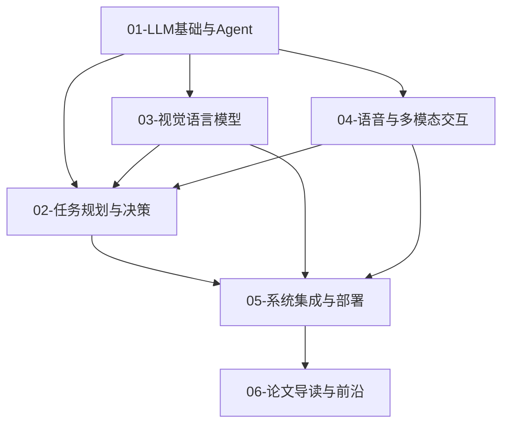

# 00 - 导读与学习路线

> 预计阅读：15 分钟 | 前置知识：无

本文档是整个项目的导航指南，帮助你了解各模块的定位、学习顺序和核心目标。

---

## 1. 项目全景

### 1.1 为什么需要 LLM 驱动的无人机？

传统无人机自主系统依赖于预编程的任务逻辑：飞行前规划好航点，飞行中按顺序执行。这种方式在结构化环境中运行良好，但面对以下场景时显得力不从心：

| 场景 | 传统方案的局限 | LLM 方案的优势 |
|------|--------------|---------------|
| 灾后搜救 | 需要人工逐条规划搜索路线 | 自然语言描述任务，LLM 自动规划 |
| 农业巡检 | 固定航线，无法识别异常 | VLM 实时识别病虫害，动态调整 |
| 物流配送 | 路线固定，无法处理突发 | LLM 重新规划避开障碍或禁飞区 |
| 安防巡逻 | 报警后人工介入 | 自然语言描述嫌疑人特征，自主跟踪 |
| 建筑巡检 | 仅按预设角度拍摄 | 语音指挥"检查北面墙体裂缝" |

### 1.2 技术演进脉络

```
2020 ────────────────────────────────────────────────────── 2026
  │                                                          │
  ├─ GPT-3 发布 (2020.06)                                    │
  │   └─ 证明大规模语言模型的涌现能力                          │
  ├─ Codex / ChatGPT (2021-2022)                             │
  │   └─ 代码生成、对话能力大幅提升                            │
  ├─ SayCan (2022.04)                                        │
  │   └─ 首次将 LLM 与机器人 affordance 结合                  │
  ├─ GPT-4 发布 (2023.03)                                    │
  │   └─ 多模态能力开启，VLM 时代来临                         │
  ├─ LLaVA / MiniGPT-4 (2023.04)                             │
  │   └─ 开源视觉语言模型涌现                                 │
  ├─ GPT-4V 发布 (2023.11)                                   │
  │   └─ 原生图像理解，视觉推理能力                            │
  ├─ RT-2 / OpenVLA (2023-2024)                              │
  │   └─ 视觉-语言-动作模型，机器人控制                        │
  ├─ Gemini 1.5 / GPT-4o (2024)                              │
  │   └─ 超长上下文、实时多模态交互                            │
  └─ 端侧大模型成熟 (2025-2026)                              │
      └─ Jetson Orin 运行 7B-13B 模型成为可能                 │
```

---

## 2. 六大模块概览

### 模块总览表

| 编号 | 模块名称 | 核心问题 | 关键技术 | 学时 |
|------|---------|---------|---------|------|
| 01 | LLM 基础与 Agent | 大模型如何工作？如何构建智能体？ | Transformer, Prompt, Agent | 15-20h |
| 02 | 任务规划与决策 | LLM 如何理解并分解飞行任务？ | NL Parsing, Task Planning | 12-15h |
| 03 | 视觉语言模型 | 无人机如何"看懂"并"说出"？ | VLM, VLA, Remote Sensing | 15-20h |
| 04 | 语音与多模态交互 | 如何用自然方式指挥无人机？ | Whisper, TTS, Gesture | 10-15h |
| 05 | 系统集成与部署 | 如何让 LLM 跑在无人机上？ | ROS2, Edge, Jetson | 15-20h |
| 06 | 论文导读与前沿 | 最新研究进展是什么？ | Paper Review | 10-15h |

### 模块依赖关系



---

## 3. 学习路线建议

### 3.1 快速入门路线（4 周）

适合已有 AI 基础、希望快速了解全貌的学习者：

| 周次 | 学习内容 | 产出 |
|------|---------|------|
| 第 1 周 | [01-01](./01-LLM基础与Agent/01-大语言模型基础.md), [01-02](./01-LLM基础与Agent/02-LLM推理与提示工程.md), [01-04](./01-LLM基础与Agent/04-多模态大模型.md) | 理解 LLM 与 VLM 核心概念 |
| 第 2 周 | [02-01](./02-任务规划与决策/01-自然语言任务理解.md), [02-02](./02-任务规划与决策/02-LLM任务分解.md), [02-05](./02-任务规划与决策/05-安全约束与人类监督.md) | 掌握 LLM 任务规划流程 |
| 第 3 周 | [03-01](./03-视觉语言模型/01-VLM在无人机中的应用.md), [03-02](./03-视觉语言模型/02-视觉语言动作VLA.md), [05-01](./05-系统集成与部署/01-ROS2集成架构.md) | 了解 VLM/VLA 与 ROS2 集成 |
| 第 4 周 | [06-01](./06-论文导读与前沿/01-LLM任务规划论文.md), [06-02](./06-论文导读与前沿/02-VLM-VLA论文.md) | 论文精读，确定研究方向 |

### 3.2 系统深入路线（8 周）

适合希望全面掌握、具备动手实践能力的学习者：

| 周次 | 学习内容 | 实践任务 |
|------|---------|---------|
| 第 1-2 周 | [01](./01-LLM基础与Agent/) 全部 5 篇 | 本地部署 Llama 3，编写简单 Agent |
| 第 3-4 周 | [02](./02-任务规划与决策/) 全部 5 篇 | 实现 NL 到飞行任务的转换 demo |
| 第 5-6 周 | [03](./03-视觉语言模型/) 全部 5 篇 | 用 LLaVA 分析航拍图像 |
| 第 7 周 | [04](./04-语音与多模态交互/) 全部 5 篇 | 语音指令控制仿真无人机 |
| 第 8 周 | [05](./05-系统集成与部署/) 全部 + [06](./06-论文导读与前沿/) 全部 | 完成系统集成原型 |

### 3.3 研究导向路线

适合研究生或希望发表论文的学习者：

1. **第一阶段**：通读 [01](./01-LLM基础与Agent/)、[02](./02-任务规划与决策/)、[03](./03-视觉语言模型/) 模块，建立理论基础
2. **第二阶段**：精读 [06](./06-论文导读与前沿/) 模块论文，识别研究空白
3. **第三阶段**：选择一个细分方向深入（如 LLM 任务规划、VLM 目标检测、多模态交互）
4. **第四阶段**：复现 1-2 篇核心论文，提出改进方案
5. **第五阶段**：在仿真环境中验证，撰写论文

---

## 4. 技术栈速查

### 4.1 软件依赖

| 类别 | 工具/库 | 用途 |
|------|--------|------|
| LLM 推理 | vLLM, llama.cpp, Ollama | 本地模型推理 |
| LLM 框架 | LangChain, LlamaIndex | Agent 构建 |
| VLM | LLaVA, Qwen-VL | 视觉理解 |
| 语音 | Whisper, Coqui TTS | 语音输入/输出 |
| 机器人 | ROS2 Humble, PX4, MAVROS | 无人机控制 |
| 仿真 | Gazebo, AirSim | 飞行仿真 |
| 深度学习 | PyTorch, ONNX | 模型训练与推理 |
| 部署 | TensorRT, ONNX Runtime | 加速推理 |

### 4.2 硬件建议

| 配置级别 | GPU | 用途 |
|---------|-----|------|
| 学习级 | RTX 3060 12GB | 运行 7B 模型，学习开发 |
| 开发级 | RTX 4090 24GB | 运行 13B 模型，完整实验 |
| 部署级 | Jetson Orin 64GB | 机载推理，实机部署 |
| 云端级 | A100/H100 | 大规模训练与服务 |

---

## 5. 学习建议

1. **先广后深**：先通读所有模块建立全景认知，再选择感兴趣的方向深入
2. **动手实践**：每读完一篇文档，尝试用代码复现核心概念
3. **论文追踪**：关注 arXiv 上的 robotics + LLM 相关论文
4. **社区参与**：加入相关 GitHub 项目和讨论社区
5. **项目驱动**：以一个具体的小项目（如"语音控制无人机拍照"）串联所学知识

---

## 思考题

1. 你认为 LLM 驱动的无人机系统相比传统方案，最大的优势和最大的风险分别是什么？
2. 如果你要设计一个"LLM + 无人机"的演示系统，你会选择什么场景？需要用到哪些模块的知识？
3. 在你的学习背景中，哪些前置知识已经具备，哪些需要补充？制定一个个人学习计划。

<details>
<summary>参考答案</summary>

**1.** 优势在于灵活性和泛化能力 — LLM 可以处理开放域的自然语言指令，无需为每种场景编程；风险在于可靠性和安全性 — LLM 的"幻觉"可能导致错误的飞行决策，在安全关键场景中不可接受。因此"人类监督 + 安全层"是核心设计原则。

**2.** 示例：农业巡检场景 — 用户语音描述"检查东北角农田是否有病虫害"，系统解析为飞行任务，VLM 分析航拍图像识别异常，生成巡检报告。需要模块：01（LLM基础）、02（任务规划）、03（VLM）、04（语音交互）、05（系统集成）。

**3.** 根据 README 中的前置知识要求逐项评估：Python/PyTorch → 是否熟练；ROS2 → 是否了解；ML 基础 → 是否扎实；UAV → 是否有飞控经验。对薄弱环节优先补充，可参考 Drone Suite 项目。

</details>
