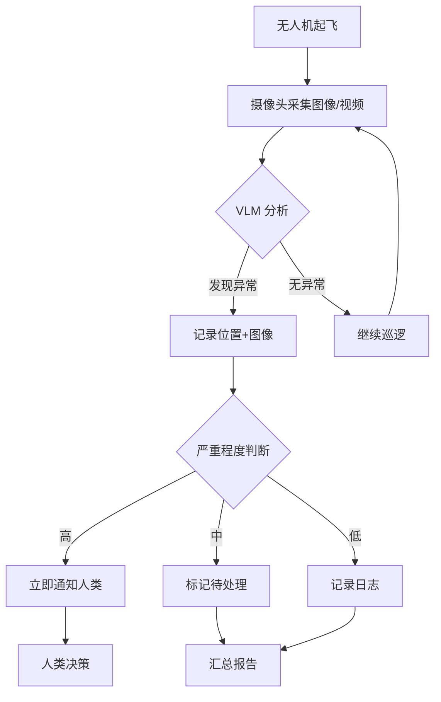

# 01-04 多模态大模型

> 预计阅读：30 分钟 | 前置知识：01-01 大语言模型基础

本文档介绍多模态大模型（Multimodal LLM）的核心技术，重点关注视觉语言模型（VLM），以及它们在无人机感知中的应用基础。

---

## 1. 什么是多模态大模型？

### 1.1 多模态的含义

"模态"指信息的表现形式。常见模态包括：

| 模态 | 数据类型 | 示例 |
|------|---------|------|
| 文本 | 字符序列 | 自然语言指令、报告 |
| 图像 | 像素矩阵 | 航拍照片、红外图像 |
| 音频 | 波形信号 | 语音指令、环境声音 |
| 视频 | 帧序列 | 实时监控画面 |
| 点云 | 3D 坐标集合 | LiDAR 扫描数据 |
| 传感器 | 数值序列 | IMU、GPS、气压计 |

**多模态大模型**是指能同时处理两种或多种模态信息的大规模神经网络模型。

### 1.2 为什么无人机需要多模态？

```
传统无人机感知:                 LLM 驱动的多模态感知:
┌──────────┐                  ┌──────────────────────┐
│ 相机 → CV │                  │  相机 ─┐             │
│ LiDAR → SLAM│               │  LiDAR ─┼→ VLM ─┐   │
│ GPS → 定位 │                 │  GPS ───┤      │   │
└──────────┘                  │  语音 ──┤   多模态  │
                              │  IMU ───┘   LLM    │
独立处理，需要手动融合          │           │   ↓    │
                              │     自然语言描述+决策│
                              └──────────────────────┘
                              自动融合，统一理解和决策
```

---

## 2. 视觉语言模型（VLM）架构

### 2.1 通用架构

现代 VLM 通常由三个核心组件构成：

```
┌─────────────┐     ┌─────────────┐     ┌─────────────┐
│ 视觉编码器  │     │ 连接模块    │     │ 语言模型    │
│ (ViT/CLIP)  │────→│ (Projector) │────→│ (LLM)       │
└─────────────┘     └─────────────┘     └─────────────┘
     ↑                                        ↑
  图像输入                               文本指令输入
```

- **视觉编码器**：将图像转换为特征向量序列
- **连接模块**：将视觉特征映射到语言模型的表示空间
- **语言模型**：基于视觉和文本输入生成回答

### 2.2 视觉编码器：ViT 与 CLIP

**ViT（Vision Transformer）** 将图像切分为 patch 并用 Transformer 处理：

```
输入图像 (224×224)
    │
    ▼
切分为 16×16 的 patch → 14×14 = 196 个 patch
    │
    ▼
每个 patch 线性映射为 embedding
    │
    ▼
添加 [CLS] token + 位置编码
    │
    ▼
Transformer Encoder (12-24 层)
    │
    ▼
输出: [CLS] 特征 + 196 个 patch 特征
```

**CLIP（Contrastive Language-Image Pre-training）** 通过对比学习将图像和文本对齐到同一空间：

```
图像 ──→ 图像编码器 ──→ 图像特征
                            ↕ 对比学习（拉近距离/推远距离）
文本 ──→ 文本编码器 ──→ 文本特征
```

### 2.3 连接模块的三种设计

| 设计方式 | 代表模型 | 特点 |
|---------|---------|------|
| 线性投影 | LLaVA-1.0 | 简单，一层 Linear |
| MLP 投影 | LLaVA-1.5 | 两层 MLP + GELU |
| Q-Former | BLIP-2, InstructBLIP | 可学习的 query tokens，更高效 |
| Perceiver Resampler | Flamingo | 交叉注意力，固定长度输出 |

### 2.4 LLaVA 架构详解

LLaVA（Large Language and Vision Assistant, Liu et al., 2023）是最具影响力的开源 VLM 之一：

```
阶段 1: 预训练对齐
  └─ 冻结 CLIP ViT-L + 冻结 Llama
  └─ 只训练线性投影层
  └─ 数据: 595K 图文对

阶段 2: 指令微调
  └─ 冻结 CLIP ViT-L
  └─ 训练投影层 + LLM (LoRA)
  └─ 数据: 665K 多模态指令数据
```

---

## 3. 主流多模态大模型对比

### 3.1 闭源模型

| 模型 | 发布 | 特点 | 无人机适用性 |
|------|------|------|------------|
| GPT-4V | 2023.09 | 强大的图文理解和推理 | 高：场景分析、任务规划 |
| GPT-4o | 2024.05 | 实时多模态，支持音频 | 高：实时交互 |
| Gemini 1.5 Pro | 2024.02 | 超长上下文(1M+)，视频理解 | 高：长航时视频分析 |
| Claude 3.5 Sonnet | 2024.06 | 精确的图像理解 | 中高：分析任务 |

### 3.2 开源模型

| 模型 | 参数量 | 基座 LLM | 视觉编码器 | 特点 |
|------|--------|---------|-----------|------|
| LLaVA-1.6 | 7B/13B | Llama/Mistral | CLIP ViT-L | 开源标杆 |
| Qwen-VL-Max | 72B | Qwen-72B | ViT-bigG | 中文最强 |
| InternVL2 | 1B-76B | InternLM2 | InternViT | 多尺寸 |
| MiniCPM-V | 8B | MiniCPM | SigLIP | 端侧友好 |
| DeepSeek-VL2 | 27B(MoE) | DeepSeek | SigLIP | 混合专家 |

### 3.3 模型选择建议

```
资源充足 (A100/H100)
├── GPT-4V / GPT-4o (API)     ← 最强性能
├── Gemini 1.5 Pro (API)      ← 长视频理解
└── Qwen-VL-Max (API/本地)    ← 中文场景

资源有限 (RTX 4090 24GB)
├── LLaVA-1.6 13B             ← 平衡性能和资源
├── InternVL2-8B              ← 轻量高效
└── Qwen-VL-Chat 7B           ← 中文优化

边缘部署 (Jetson Orin)
├── LLaVA-1.6 7B (INT4)       ← 可接受精度
├── MiniCPM-V                  ← 专为端侧设计
└── InternVL2-1B               ← 极致轻量
```

---

## 4. VLM 的核心能力

### 4.1 图像描述（Image Captioning）

```python
# 使用 LLaVA 生成无人机航拍图像描述
from llava.model.builder import load_pretrained_model
from llava.mm_utils import get_model_name_from_path
from llava.eval.run_llava import eval_model

prompt = """请详细描述这张无人机航拍图像的内容，包括：
1. 地形特征
2. 建筑物分布
3. 道路和交通情况
4. 植被覆盖
5. 是否有异常情况"""

# 模型输出示例:
# "这是一张城市郊区的航拍图像。图像中央有一个大型停车场，
# 停放了约30辆车。停车场东侧是三栋住宅楼，西侧是一条双向
# 四车道公路。东北角有一片绿地/公园。未发现明显异常情况。
# 建议对停车场南侧的施工区域进行进一步检查。"
```

### 4.2 视觉问答（VQA）

```python
# 针对无人机场景的 VQA
questions = [
    "图像中是否有河流或水域？",
    "建筑群的密度如何？",
    "是否有适合降落的空地？",
    "道路上的交通拥堵程度？",
    "图像中是否有运动中的人或车辆？",
    "该区域的绿化覆盖率大约是多少？"
]
```

### 4.3 目标检测与定位

VLM 可以通过语言描述来定位目标：

```
用户: "在图像中标注出所有红色车辆的位置"

VLM 输出:
  检测到 3 辆红色车辆:
  1. 位置: (320, 240) - 停车场左侧
  2. 位置: (450, 180) - 道路上行驶中
  3. 位置: (280, 350) - 加油站内
```

---

## 5. 视频理解

### 5.1 视频分析策略

处理无人机航拍视频的几种策略：

| 策略 | 方法 | 适用场景 |
|------|------|---------|
| 关键帧提取 | 均匀/自适应采样帧 | 长视频概览 |
| 密集帧分析 | 每帧/每 N 帧分析 | 精细监控 |
| 滑动窗口 | 固定窗口大小分析 | 实时流处理 |
| 分层分析 | 先粗后细 | 大范围搜索 |

### 5.2 Gemini 的长视频能力

```python
# 使用 Gemini 1.5 Pro 分析无人机航拍视频
import google.generativeai as genai

genai.configure(api_key="your-api-key")
model = genai.GenerativeModel("gemini-1.5-pro")

# 上传视频
video_file = genai.upload_file(path="flight_recording.mp4")

# 分析视频
response = model.generate_content([
    video_file,
    """请分析这段无人机航拍视频，回答以下问题：
    1. 视频覆盖了哪些区域？
    2. 是否有异常活动或事件？
    3. 环境条件如何变化？
    4. 有哪些值得关注的目标？
    请按时间顺序描述视频内容。"""
])

print(response.text)
```

---

## 6. VLM 在无人机中的应用场景

### 6.1 应用场景矩阵

| 场景 | 输入模态 | 输出模态 | 核心能力 |
|------|---------|---------|---------|
| 航拍图像分析 | 图像 + 文本问题 | 文本描述 | 图像理解、VQA |
| 灾后评估 | 图像/视频 | 结构化报告 | 场景理解、变化检测 |
| 目标搜索 | 图像 + 目标描述 | 目标位置 | 视觉定位 |
| 农业巡检 | 多光谱图像 | 健康评估报告 | 专业图像分析 |
| 建筑巡检 | 图像 + 检查标准 | 缺陷报告 | 细粒度识别 |
| 交通监控 | 视频流 | 交通状态描述 | 动态理解 |
| 人员搜救 | 热成像 + 可见光 | 人员位置 | 多模态融合 |

### 6.2 典型工作流



---

## 7. 技术挑战

### 7.1 当前局限性

| 挑战 | 描述 | 可能的解决方案 |
|------|------|--------------|
| 延迟 | VLM 推理需要数百毫秒至数秒 | 模型量化、TensorRT 加速 |
| 小目标检测 | 远距离小目标识别困难 | 高分辨率输入、局部放大 |
| 光照变化 | 逆光/阴影影响理解 | 多曝光融合、训练增强 |
| 3D 理解 | 2D 图像缺乏深度信息 | 结合 LiDAR/深度相机 |
| 实时性 | 难以满足 30fps 实时要求 | 关键帧策略、边缘加速 |
| 幻觉 | 可能描述图中不存在的内容 | 多模型交叉验证 |

### 7.2 与传统 CV 的互补

```
VLM 擅长:                    传统 CV 擅长:
├── 开放域场景理解             ├── 精确目标检测 (YOLO, DETR)
├── 自然语言描述               ├── 像素级分割
├── 零样本泛化                 ├── 实时处理 (30fps+)
├── 推理和常识判断             ├── 3D 重建
└── 多模态融合                 └── 精确测量

最佳方案: VLM + 传统 CV 混合架构
├── CV 做实时检测和定位
├── VLM 做场景理解和决策
└── 两者互补，各取所长
```

---

## 思考题

1. VLM 的三个核心组件（视觉编码器、连接模块、语言模型）各自的作用是什么？如果替换其中一个组件，会对模型能力产生什么影响？
2. 对比 LLaVA 和 BLIP-2 的连接模块设计，各有什么优缺点？
3. 在无人机场景中，VLM 和传统 CV（如 YOLO）应该如何协作？设计一个混合架构。
4. VLM 的"幻觉"问题在无人机场景中可能带来什么后果？如何缓解？
5. 如何利用 Gemini 1.5 Pro 的长上下文能力分析一整段 30 分钟的航拍视频？

<details>
<summary>参考答案</summary>

**1.** 视觉编码器负责将像素级的图像信息压缩为高层语义特征。连接模块负责将视觉特征"翻译"为语言模型能理解的表示（对齐两个模态的空间）。语言模型负责基于视觉信息和文本指令生成自然语言输出。替换视觉编码器（如从 CLIP 换为 DINOv2）可能改变视觉特征的质量和侧重；替换连接模块影响对齐效率；替换语言模型影响推理和生成能力。

**2.** LLaVA 使用简单的线性/MLP 投影，优点是简单高效、训练快速；缺点是投影能力有限。BLIP-2 使用 Q-Former（可学习的查询 token），优点是可以压缩视觉 token 数量、更高效地利用视觉信息；缺点是结构复杂、需要更多训练数据。实践中 LLaVA-1.5 的 MLP 方案效果出人意料地好，说明简单的对齐方式在很多场景下已足够。

**3.** 混合架构：(1) YOLO 做实时目标检测（30fps），输出边界框和类别；(2) 当检测到异常或用户提问时，将相关区域裁剪发送给 VLM 进行详细分析；(3) VLM 提供自然语言描述和高级推理；(4) 融合两者结果生成最终报告。这样既保证了实时性，又获得了深度理解。

**4.** VLM 可能描述不存在的危险（如误报裂缝、误报人员），导致不必要的应急响应；也可能遗漏真实危险（如未识别出实际存在的障碍物）。缓解：(1) 多次采样一致性检查；(2) 与传统 CV 结果交叉验证；(3) 关键决策要求人类确认；(4) 使用置信度阈值过滤低置信度检测。

**5.** 策略：(1) 将 30 分钟视频按每 5 秒提取关键帧，得到约 360 帧；(2) 将帧序列输入 Gemini 1.5 Pro 的长上下文；(3) 设计分层提示：先要求整体概览，再要求按时间段详细分析；(4) 利用时间戳标注将分析结果映射回具体时刻；(5) 对重要时段可单独提取更密集的帧进行精细分析。

</details>
