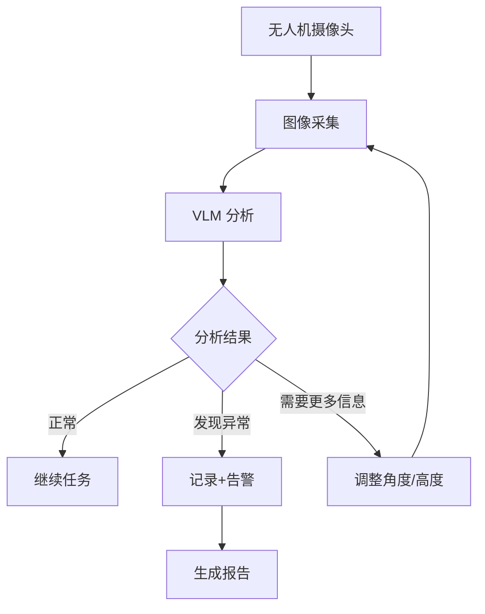

# 03-01 VLM 在无人机中的应用

> 预计阅读：30 分钟 | 前置知识：01-04 多模态大模型

本文档介绍视觉语言模型（VLM）在无人机领域的具体应用场景，包括场景理解、目标检测和视觉问答。

---

## 1. VLM 与无人机的结合

### 1.1 核心价值

传统无人机视觉系统依赖预训练的专用模型（如 YOLO 检测特定目标），而 VLM 带来了全新的能力：

| 能力 | 传统 CV | VLM |
|------|--------|-----|
| 目标检测 | 预定义类别（人、车、建筑） | 开放词汇（"穿红衣服的人"） |
| 场景理解 | 需要多模型组合 | 单模型统一理解 |
| 异常检测 | 需要大量标注数据 | 零样本异常识别 |
| 报告生成 | 需要模板填充 | 自然语言描述 |
| 交互方式 | 编程接口 | 自然语言对话 |

### 1.2 典型工作流



### 1.3 实际 API 调用示例

以下是使用 GPT-4V / GPT-4o 进行无人机航拍图像理解的真实 API 调用代码：

```python
import base64
from openai import OpenAI

client = OpenAI()  # 从环境变量读取 OPENAI_API_KEY

# 将本地图像编码为 base64
with open("drone_view.jpg", "rb") as f:
    image_b64 = base64.b64encode(f.read()).decode()

response = client.chat.completions.create(
    model="gpt-4o",
    messages=[{
        "role": "user",
        "content": [
            {
                "type": "text",
                "text": "Describe obstacles visible for drone navigation. "
                        "For each obstacle, estimate its position (left/center/right, near/far), "
                        "approximate size, and whether it poses an immediate collision risk."
            },
            {
                "type": "image_url",
                "image_url": {
                    "url": f"data:image/jpeg;base64,{image_b64}"
                }
            }
        ]
    }],
    max_tokens=500
)

print(response.choices[0].message.content)
```

使用 URL 图像（适合从无人机流媒体地址直接分析）：

```python
import anthropic

client = anthropic.Anthropic()  # 从环境变量读取 ANTHROPIC_API_KEY

message = client.messages.create(
    model="claude-sonnet-4-6",
    max_tokens=500,
    messages=[{
        "role": "user",
        "content": [
            {
                "type": "image",
                "source": {
                    "type": "url",
                    "url": "http://192.168.1.100:8080/stream/current_frame.jpg"
                }
            },
            {
                "type": "text",
                "text": "这张无人机航拍图像中有哪些障碍物？请标注每个障碍物的位置和危险等级。"
            }
        ]
    }]
)

print(message.content[0].text)
```

---

## 2. 场景理解

### 2.1 航拍图像场景描述

```python
def describe_scene(image, vlm_client):
    """使用 VLM 描述航拍场景"""

    prompt = """请详细描述这张无人机航拍图像的内容。

请按以下结构描述:
1. 总体场景类型（城市/郊区/农村/工业区等）
2. 地形特征（平坦/丘陵/水域等）
3. 主要建筑/结构物（类型、数量、分布）
4. 道路和交通（道路类型、车辆密度）
5. 植被覆盖（绿化程度、植被类型）
6. 人员活动（可见人数、活动类型）
7. 异常情况（如有）
8. 安全评估（适合飞行与否）"""

    return vlm_client.analyze(image, prompt)
```

### 2.2 场景理解示例

```python
# VLM 输出示例:
"""
1. 总体场景: 城市郊区工业园区
2. 地形: 平坦，少量绿化带
3. 建筑物:
   - 3栋大型厂房（灰色屋顶，东侧）
   - 1栋办公楼（白色，西侧，4层）
   - 2个仓库（蓝色屋顶，中部）
4. 道路:
   - 主路: 双向四车道，东西走向，车辆稀少
   - 支路: 园区内部道路，有2辆货车停放
5. 植被: 绿化率约15%，主要在道路两侧
6. 人员: 可见约5人在厂房入口处
7. 异常: 东北角发现疑似积水区域
8. 安全评估: 适合飞行，注意避开东侧烟囱（高度约30米）
"""
```

---

## 3. 目标检测与定位

### 3.1 开放词汇目标检测

VLM 不限于预定义类别，可以通过自然语言描述查找任意目标：

```python
def detect_targets(image, target_description, vlm_client):
    """使用 VLM 检测目标"""

    prompt = f"""请在这张无人机航拍图像中查找以下目标:

目标描述: {target_description}

对于每个找到的目标，请提供:
1. 位置（图像中的相对位置，如"左上角"、"中央偏右"）
2. 像素坐标估计 (x, y)
3. 置信度 (0-1)
4. 简要描述

如果没有找到目标，请说明。"""

    return vlm_client.analyze(image, prompt)
```

### 3.2 检测示例

```python
# 输入: "找图像中所有的红色车辆"
# 输出:
"""
检测到 3 辆红色车辆:

1. 位置: 图像中央偏左，停车场内
   像素坐标: 约 (320, 280)
   置信度: 0.92
   描述: 红色SUV，停放状态

2. 位置: 图像右侧，道路上
   像素坐标: 约 (580, 200)
   置信度: 0.85
   描述: 红色轿车，行驶中

3. 位置: 图像下方，加油站附近
   像素坐标: 约 (400, 450)
   置信度: 0.78
   描述: 红色卡车，部分被遮挡
"""
```

---

## 4. 视觉问答（VQA）

### 4.1 巡检类问答

```python
# 无人机巡检中的典型问题
inspection_questions = {
    "建筑巡检": [
        "屋顶是否有明显的损坏或裂缝？",
        "外墙是否有脱落或变色？",
        "窗户是否完好？",
        "是否有积水迹象？",
    ],
    "农业巡检": [
        "作物的生长状况如何？",
        "是否有病虫害的迹象？",
        "灌溉系统是否正常？",
        "是否有杂草？",
    ],
    "安全巡检": [
        "是否有未授权的人员进入？",
        "围栏是否完好？",
        "消防通道是否畅通？",
        "是否有危险物品存放不当？",
    ]
}
```

### 4.2 多轮对话式巡检

```python
class ConversationalInspection:
    """对话式巡检系统"""

    def __init__(self, vlm_client):
        self.vlm = vlm_client
        self.history = []

    def ask(self, image, question):
        """提问关于当前图像的问题"""
        context = "\n".join([f"Q: {h['q']}\nA: {h['a']}" for h in self.history[-5:]])

        prompt = f"""你是一个专业的无人机巡检分析师。

之前的对话:
{context}

当前图像: [已提供]

问题: {question}

请基于图像内容回答，如果不确定请说明。"""

        answer = self.vlm.analyze(image, prompt)
        self.history.append({"q": question, "a": answer})
        return answer
```

---

## 5. 异常检测

### 5.1 基于 VLM 的异常检测

```python
def detect_anomalies(image, context, vlm_client):
    """使用 VLM 检测异常"""

    prompt = f"""你是一个专业的无人机巡检安全分析师。
请分析这张航拍图像，检测任何异常情况。

巡检上下文: {context}

请检查:
1. 与正常状态不符的物体或现象
2. 潜在的安全隐患
3. 需要关注的区域
4. 紧急情况迹象

对每个发现的异常，请评估:
- 异常类型
- 严重程度 (低/中/高/紧急)
- 建议的处理方式"""

    return vlm_client.analyze(image, prompt)
```

### 5.2 异常检测示例

```python
# VLM 输出:
"""
检测到以下异常:

1. 异常类型: 积水
   位置: 东北角低洼区域
   严重程度: 中
   描述: 发现约20平方米的积水区域，可能是排水系统故障
   建议: 标记位置，通知维护人员检查排水系统

2. 异常类型: 可疑车辆
   位置: 围墙外侧
   严重程度: 低
   描述: 一辆白色面包车长时间停放，车窗有遮挡
   建议: 持续关注，如超24小时未移动则通知安保

3. 异常类型: 设备异常
   位置: 南侧厂房屋顶
   严重程度: 高
   描述: 屋顶一处设备疑似倾斜，可能有倒塌风险
   建议: 立即通知现场人员远离该区域
"""
```

---

## 6. 多图分析

### 6.1 时序对比

```python
def compare_temporal(images_with_timestamps, vlm_client):
    """比较不同时间的图像，检测变化"""

    prompt = """请比较以下不同时间拍摄的同一区域的航拍图像。

图像1 (2024-01-15): [已提供]
图像2 (2024-01-20): [已提供]

请分析:
1. 两次拍摄之间发生了哪些变化？
2. 新增或消失的物体
3. 环境变化（植被、积水等）
4. 需要关注的趋势"""

    return vlm_client.analyze_multi(images_with_timestamps, prompt)
```

### 6.2 多角度分析

```python
def multi_angle_analysis(images, vlm_client):
    """从多个角度分析同一目标"""

    prompt = """以下是同一建筑从不同角度拍摄的航拍图像。
请综合分析该建筑的状况。

角度1 (北面): [已提供]
角度2 (东面): [已提供]
角度3 (南面): [已提供]
角度4 (西面): [已提供]

请综合评估:
1. 建筑整体状况
2. 各面外墙情况
3. 屋顶状况
4. 发现的问题汇总"""

    return vlm_client.analyze_multi(images, prompt)
```

---

## 7. 性能优化

### 7.1 VLM 推理加速

| 方法 | 效果 | 精度影响 |
|------|------|---------|
| 图像下采样 | 减少计算量 | 低分辨率可能遗漏细节 |
| 关键帧选择 | 减少调用次数 | 可能错过瞬间变化 |
| 模型量化 | INT4/INT8 加速 | 微小精度损失 |
| TensorRT | GPU 加速 2-5x | 无 |
| 结果缓存 | 避免重复分析 | 相同图像不重复调用 |

### 7.2 智能调用策略

```python
class SmartVLMCaller:
    """智能 VLM 调用策略"""

    def __init__(self, vlm_client, cv_client):
        self.vlm = vlm_client
        self.cv = cv_client  # 轻量 CV 模型

    def analyze(self, image):
        # 1. 先用轻量 CV 模型做初步检测
        cv_result = self.cv.detect(image)

        # 2. 如果 CV 检测到异常或高置信度目标，调用 VLM 深入分析
        if cv_result["anomalies"] or cv_result["high_confidence"]:
            return self.vlm.analyze(image, self._build_prompt(cv_result))

        # 3. 周期性调用 VLM 做全局理解
        if self._should_do_periodic_check():
            return self.vlm.analyze(image, "请描述当前场景")

        # 4. 否则只返回 CV 结果
        return cv_result
```

---

## 思考题

1. VLM 在无人机巡检中相比传统 CV 方案有什么独特优势？有哪些场景传统 CV 更合适？
2. 如何设计 VLM 的调用策略以平衡分析深度和实时性？
3. VLM 的"幻觉"问题在无人机安全巡检中可能带来什么后果？如何缓解？
4. 设计一个完整的 VLM 驱动的建筑巡检系统，从图像采集到报告生成。
5. 如何利用 VLM 的多图分析能力进行变化检测？

<details>
<summary>参考答案</summary>

**1.** VLM 独特优势：(1) 开放词汇检测 — 可以检测任意描述的目标，不需要预先训练；(2) 场景理解 — 可以理解复杂场景的语义；(3) 报告生成 — 直接生成自然语言报告。传统 CV 更合适的场景：(1) 需要实时性（30fps）的目标跟踪；(2) 需要精确边界框的测量任务；(3) 特定类别的高精度检测（如人脸）。

**2.** 分层策略：(1) 实时层 — 轻量 CV 模型持续运行（30fps），检测基本目标和异常；(2) 分析层 — 当 CV 发现异常时，调用 VLM 深入分析；(3) 全局层 — 定期（如每30秒）调用 VLM 做全局场景理解。这样既保证实时性，又获得深度分析。

**3.** 后果：VLM 可能报告不存在的裂缝或损坏（假阳性），导致不必要的停工检查；也可能遗漏实际存在的问题（假阴性），导致安全隐患。缓解：(1) 要求 VLM 提供置信度；(2) 多角度验证（同一区域从不同角度拍摄）；(3) 与传统 CV 结果交叉验证；(4) 关键发现要求人工确认。

**4.** 完整系统：(1) 规划阶段 — LLM 生成巡检路线和拍照计划；(2) 执行阶段 — 无人机按计划飞行，自动拍照；(3) 分析阶段 — VLM 逐张分析图像，检测问题；(4) 汇总阶段 — 将所有发现汇总为结构化报告；(5) 报告生成 — LLM 生成自然语言巡检报告。每个阶段都应有异常处理机制。

**5.** 变化检测：(1) 在同一位置不同时间拍摄图像对；(2) 使用 VLM 比较两幅图像，识别差异；(3) VLM 可以理解语义变化（如"新增了一个建筑物"），而像素级差分只能检测像素变化；(4) 适合定期复查、灾后评估等场景。

</details>
