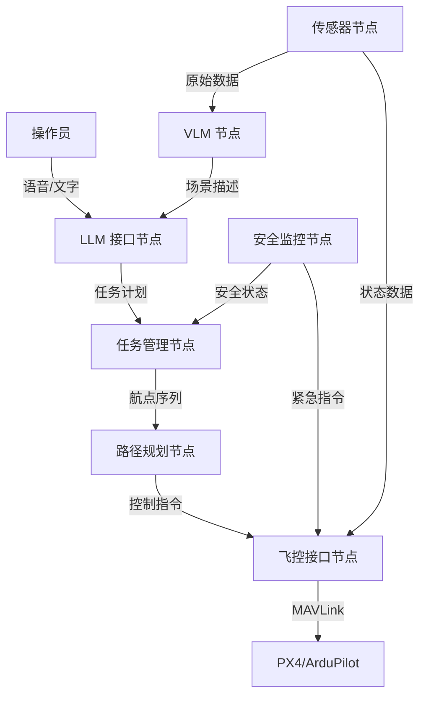

# 05-01 ROS2 集成架构

> 预计阅读：30 分钟 | 前置知识：ROS2 基础、01-03 Agent架构设计

本文档介绍如何将 LLM 集成到 ROS2 无人机系统中，包括节点设计、服务接口和系统架构。

---

## 1. ROS2 + LLM 架构概述

### 1.1 系统架构



### 1.2 节点职责

| 节点 | 职责 | 输入 | 输出 |
|------|------|------|------|
| LLM 接口 | 自然语言理解 | 语音/文字 | 结构化指令 |
| 任务管理 | 任务规划和调度 | 结构化指令 | 任务序列 |
| 路径规划 | 航点生成和优化 | 任务序列 | 航点列表 |
| 飞控接口 | MAVLink 通信 | 航点列表 | 飞控指令 |
| VLM 节点 | 视觉理解 | 图像 | 场景描述 |
| 安全监控 | 安全检查 | 全局状态 | 安全指令 |

---

## 2. ROS2 节点实现

### 2.1 LLM 接口节点

```python
import rclpy
from rclpy.node import Node
from std_msgs.msg import String
from geometry_msgs.msg import PoseStamped
import json

class LLMInterfaceNode(Node):
    """LLM 接口节点"""

    def __init__(self):
        super().__init__('llm_interface')

        # 订阅
        self.voice_sub = self.create_subscription(
            String, 'voice/command', self.voice_callback, 10)
        self.text_sub = self.create_subscription(
            String, 'text/command', self.text_callback, 10)

        # 发布
        self.task_pub = self.create_publisher(
            String, 'llm/task_plan', 10)
        self.status_pub = self.create_publisher(
            String, 'llm/status', 10)

        # LLM 客户端
        self.llm_client = LLMClient()
        self.get_logger().info('LLM 接口节点已启动')

    def voice_callback(self, msg):
        """处理语音输入"""
        self.get_logger().info(f'收到语音指令: {msg.data}')
        task_plan = self.parse_command(msg.data)
        if task_plan:
            self.publish_task(task_plan)

    def text_callback(self, msg):
        """处理文字输入"""
        self.get_logger().info(f'收到文字指令: {msg.data}')
        task_plan = self.parse_command(msg.data)
        if task_plan:
            self.publish_task(task_plan)

    def parse_command(self, command):
        """解析命令为任务计划"""
        prompt = f"""将以下指令转换为无人机任务计划:
指令: {command}

输出 JSON 格式的任务计划。"""
        response = self.llm_client.generate(prompt)
        try:
            return json.loads(response)
        except:
            self.get_logger().error(f'解析失败: {response}')
            return None

    def publish_task(self, task_plan):
        """发布任务计划"""
        msg = String()
        msg.data = json.dumps(task_plan, ensure_ascii=False)
        self.task_pub.publish(msg)
        self.get_logger().info(f'发布任务: {msg.data}')
```

### 2.2 任务管理节点

```python
class TaskManagerNode(Node):
    """任务管理节点"""

    def __init__(self):
        super().__init__('task_manager')

        self.task_sub = self.create_subscription(
            String, 'llm/task_plan', self.task_callback, 10)
        self.waypoint_pub = self.create_publisher(
            PoseStamped, 'planning/waypoint', 10)
        self.safety_sub = self.create_subscription(
            String, 'safety/status', self.safety_callback, 10)

        self.current_task = None
        self.task_queue = []

    def task_callback(self, msg):
        """接收任务计划"""
        task = json.loads(msg.data)
        self.get_logger().info(f'收到任务: {task["task_name"]}')

        # 安全检查
        if self.check_safety(task):
            self.execute_task(task)
        else:
            self.get_logger().warn('任务未通过安全检查')

    def execute_task(self, task):
        """执行任务"""
        self.current_task = task
        for step in task['steps']:
            waypoint = self.step_to_waypoint(step)
            self.waypoint_pub.publish(waypoint)
            # 等待到达
            self.wait_for_arrival()

    def step_to_waypoint(self, step):
        """将任务步骤转换为航点"""
        pose = PoseStamped()
        pose.pose.position.x = step.get('lat', 0)
        pose.pose.position.y = step.get('lon', 0)
        pose.pose.position.z = step.get('alt', 0)
        return pose
```

### 2.3 VLM 节点

```python
class VLMNode(Node):
    """VLM 视觉理解节点"""

    def __init__(self):
        super().__init__('vlm_node')

        self.image_sub = self.create_subscription(
            Image, 'camera/image_raw', self.image_callback, 10)
        self.description_pub = self.create_publisher(
            String, 'vlm/description', 10)
        self.anomaly_pub = self.create_publisher(
            String, 'vlm/anomaly', 10)

        self.vlm_client = VLMClient()
        self.analysis_interval = 5.0  # 每5秒分析一次
        self.last_analysis_time = 0

    def image_callback(self, msg):
        """处理图像"""
        current_time = time.time()
        if current_time - self.last_analysis_time < self.analysis_interval:
            return

        # 转换图像格式
        image = self.bridge.imgmsg_to_cv2(msg, "bgr8")

        # VLM 分析
        description = self.vlm_client.analyze(
            image, "请描述当前场景，如有异常请特别指出")

        # 发布描述
        desc_msg = String()
        desc_msg.data = description
        self.description_pub.publish(desc_msg)

        # 检测异常
        if "异常" in description or "危险" in description:
            anomaly_msg = String()
            anomaly_msg.data = description
            self.anomaly_pub.publish(anomaly_msg)

        self.last_analysis_time = current_time
```

---

## 3. 自定义消息类型

### 3.1 任务计划消息

```python
# msg/TaskPlan.msg
string task_name
string description
float64 estimated_time
string risk_level
TaskStep[] steps

# msg/TaskStep.msg
int32 id
string action
float64 latitude
float64 longitude
float64 altitude
float64 speed
string parameters_json
```

### 3.2 服务接口

```python
# srv/LLMQuery.srv
string prompt
string context
---
string response
bool success
string error_message

# srv/SafetyCheck.srv
string task_plan_json
string flight_state_json
---
bool passed
string[] violations
string[] warnings
```

---

## 4. Launch 文件

```python
# launch/llm_uav_system.launch.py
from launch import LaunchDescription
from launch_ros.actions import Node

def generate_launch_description():
    return LaunchDescription([
        Node(
            package='llm_uav',
            executable='llm_interface_node',
            name='llm_interface',
            parameters=[{
                'model': 'gpt-4',
                'temperature': 0.3
            }]
        ),
        Node(
            package='llm_uav',
            executable='task_manager_node',
            name='task_manager'
        ),
        Node(
            package='llm_uav',
            executable='vlm_node',
            name='vlm',
            parameters=[{
                'model': 'llava-1.6-7b',
                'analysis_interval': 5.0
            }]
        ),
        Node(
            package='llm_uav',
            executable='safety_monitor_node',
            name='safety_monitor'
        ),
        Node(
            package='llm_uav',
            executable='mavros_node',
            name='mavros'
        ),
    ])
```

### 4.2 完整 Launch 文件示例

以下是一个包含参数声明、条件加载和生命周期管理的完整 launch 文件：

```python
# launch/llm_uav_full.launch.py
import os
from launch import LaunchDescription
from launch.actions import DeclareLaunchArgument, GroupAction, IncludeLaunchDescription
from launch.conditions import IfCondition, UnlessCondition
from launch.substitutions import LaunchConfiguration, PathJoinSubstitution
from launch_ros.actions import Node, PushRosNamespace
from launch_ros.substitutions import FindPackageShare

def generate_launch_description():
    # ---- Launch 参数声明 ----
    model_arg = DeclareLaunchArgument(
        'model', default_value='gpt-4',
        description='LLM 模型名称 (gpt-4 / llama3 / qwen2)'
    )
    use_vlm_arg = DeclareLaunchArgument(
        'use_vlm', default_value='true',
        description='是否启用 VLM 视觉节点'
    )
    sim_mode_arg = DeclareLaunchArgument(
        'sim', default_value='false',
        description='仿真模式 (true=Gazebo, false=实机)'
    )
    namespace_arg = DeclareLaunchArgument(
        'ns', default_value='uav_0',
        description='ROS2 命名空间'
    )

    # ---- 参数引用 ----
    model = LaunchConfiguration('model')
    use_vlm = LaunchConfiguration('use_vlm')
    sim_mode = LaunchConfiguration('sim')

    # ---- 配置文件路径 ----
    config_dir = PathJoinSubstitution([
        FindPackageShare('llm_uav'), 'config'
    ])

    # ---- 核心节点组 ----
    core_nodes = GroupAction([
        PushRosNamespace(LaunchConfiguration('ns')),

        # LLM 接口节点
        Node(
            package='llm_uav',
            executable='llm_interface_node',
            name='llm_interface',
            parameters=[
                PathJoinSubstitution([config_dir, 'llm_params.yaml']),
                {'model': model, 'temperature': 0.3, 'max_tokens': 512}
            ],
            remappings=[
                ('voice/command', '/voice/command'),
                ('llm/task_plan', 'task_plan'),
            ],
            output='screen',
        ),

        # 任务管理节点
        Node(
            package='llm_uav',
            executable='task_manager_node',
            name='task_manager',
            parameters=[{'max_queue_size': 10, 'safety_timeout': 5.0}],
            output='screen',
        ),

        # 安全监控节点
        Node(
            package='llm_uav',
            executable='safety_monitor_node',
            name='safety_monitor',
            parameters=[{'geofence_radius': 500.0, 'min_altitude': 5.0, 'max_altitude': 120.0}],
            output='screen',
        ),
    ])

    # ---- VLM 节点 (条件加载) ----
    vlm_node = Node(
        package='llm_uav',
        executable='vlm_node',
        name='vlm',
        parameters=[
            PathJoinSubstitution([config_dir, 'vlm_params.yaml']),
            {'model': 'llava-1.6-7b', 'analysis_interval': 5.0, 'image_resolution': 640}
        ],
        condition=IfCondition(use_vlm),
        output='screen',
    )

    # ---- 飞控接口 (仿真 vs 实机) ----
    sim_mavros = Node(
        package='mavros',
        executable='mavros_node',
        name='mavros',
        parameters=[{
            'fcu_url': 'udp://:14550@127.0.0.1:14555',
            'gcs_url': 'udp://:14551@127.0.0.1:14550',
        }],
        condition=IfCondition(sim_mode),
        output='screen',
    )

    real_mavros = Node(
        package='mavros',
        executable='mavros_node',
        name='mavros',
        parameters=[{
            'fcu_url': '/dev/ttyUSB0:921600',
            'gcs_url': 'udp://:14550@',
        }],
        condition=UnlessCondition(sim_mode),
        output='screen',
    )

    return LaunchDescription([
        model_arg,
        use_vlm_arg,
        sim_mode_arg,
        namespace_arg,
        core_nodes,
        vlm_node,
        sim_mavros,
        real_mavros,
    ])
```

启动命令示例：

```bash
# 仿真模式，使用 GPT-4
ros2 launch llm_uav llm_uav_full.launch.py sim:=true model:=gpt-4

# 实机模式，不启用 VLM
ros2 launch llm_uav llm_uav_full.launch.py sim:=false use_vlm:=false ns:=drone_alpha
```

### 4.3 自定义消息定义文件

以下是在 `msg/` 目录下定义的完整 `.msg` 文件，需在 `CMakeLists.txt` 中通过 `rosidl_generate_interfaces` 注册：

```msg
# msg/FlightState.msg
# 无人机实时飞行状态，由飞控接口节点发布

std_msgs/Header header

# 位置 (NED 或 WGS84，由 frame_id 区分)
float64 latitude
float64 longitude
float64 altitude_relative    # 相对起飞点高度 (m)
float64 altitude_amsl        # 海拔高度 (m)

# 速度 (m/s)
float64 vx
float64 vy
float64 vz

# 姿态 (四元数)
float64 qx
float64 qy
float64 qz
float64 qw

# 电池状态
float32 battery_voltage      # V
float32 battery_remaining    # 0.0 - 1.0
float32 battery_current      # A

# 飞行模式与状态
string flight_mode           # OFFBOARD / AUTO.MISSION / LOITER / LAND ...
string arming_state          # ARMED / DISARMED
bool is_in_air

# GPS 状态
uint8 gps_fix_type           # 0=无, 2=2D, 3=3D, 4=DGPS, 6=RTK
uint8 satellites_visible
float32 hdop                 # 水平精度因子
```

```msg
# msg/LlmEvent.msg
# LLM 推理事件，由 LLM 接口节点在关键决策时发布，用于日志和遥测

std_msgs/Header header

string event_id              # UUID
string event_type            # TASK_RECEIVED / TASK_PARSED / PLAN_GENERATED / ERROR
string raw_input             # 原始用户输入
string parsed_json           # 解析后的 JSON 任务计划
string model_used            # 使用的模型名称
int32  prompt_tokens         # 输入 token 数
int32  completion_tokens     # 输出 token 数
float32 inference_latency_ms # 推理耗时 (ms)
string error_detail          # 错误详情 (仅 event_type=ERROR 时)
```

对应的 `CMakeLists.txt` 注册片段：

```cmake
find_package(rosidl_default_generators REQUIRED)

rosidl_generate_interfaces(${PROJECT_NAME}
  "msg/FlightState.msg"
  "msg/LlmEvent.msg"
  "msg/TaskPlan.msg"
  "msg/TaskStep.msg"
  "srv/LLMQuery.srv"
  "srv/SafetyCheck.srv"
  "action/FlyMission.action"
  DEPENDENCIES std_msgs
)
```

---

## 5. 通信模式

### 5.1 Topic vs Service vs Action

| 模式 | 适用场景 | 示例 |
|------|---------|------|
| Topic | 持续数据流 | 传感器数据、状态发布 |
| Service | 请求-响应 | LLM 查询、安全检查 |
| Action | 长时间任务 | 飞行任务、巡逻 |

### 5.2 Action 接口

```python
# action/FlyMission.action
string task_plan_json
---
string result_message
bool success
---
float32 progress
string current_step
string status_message
```

---

## 思考题

1. 为什么 LLM 接口节点和任务管理节点要分开设计？
2. 如何处理 LLM 推理延迟对实时性的影响？
3. ROS2 的 QoS 策略如何配置以适应无人机场景？
4. 如何设计节点间的错误处理和恢复机制？
5. 如何测试 LLM 集成的 ROS2 系统？

<details>
<summary>参考答案</summary>

**1.** 分离设计的好处：(1) 单一职责 — LLM 接口只负责语言理解，任务管理只负责调度；(2) 可替换性 — 可以替换 LLM 后端而不影响任务管理；(3) 故障隔离 — LLM 故障不会影响飞控安全；(4) 可测试性 — 每个节点可以独立测试。

**2.** 策略：(1) LLM 推理在非实时路径上 — 不影响飞控的实时控制；(2) 预测性推理 — 在到达航点前预先计算下一步；(3) 缓存 — 对常见指令缓存结果；(4) 降级 — LLM 不可用时切换到预设任务。

**3.** QoS 配置：(1) 传感器数据 — BEST_EFFORT，允许丢帧；(2) 控制指令 — RELIABLE，保证送达；(3) 安全消息 — RELIABLE + 深度队列；(4) 日志 — BEST_EFFORT，减少开销。

**4.** 错误处理：(1) 节点健康检查 — 定期心跳；(2) 超时处理 — LLM 查询超时后使用默认响应；(3) 重启策略 — 关键节点崩溃后自动重启；(4) 降级模式 — 部分功能失效时保持核心功能。

**5.** 测试策略：(1) 单元测试 — 每个节点独立测试；(2) 集成测试 — 节点间通信测试；(3) 仿真测试 — 在 Gazebo 中完整测试；(4) 回归测试 — 确保新功能不影响已有功能；(5) LLM 输出测试 — 验证 LLM 输出格式和内容。

</details>
