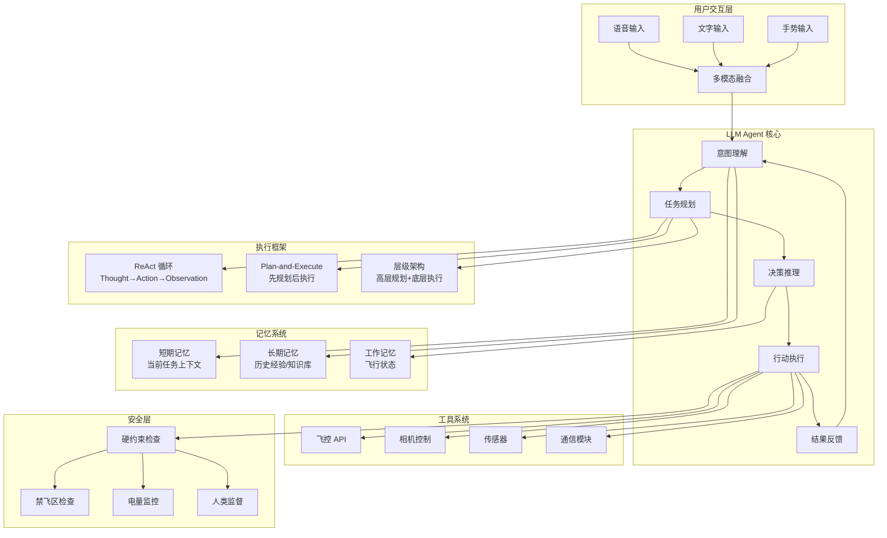

# LLM Agent 系统架构



## 关键组件说明

| 组件 | 功能 | 技术实现 |
|------|------|---------|
| 意图理解 | 解析用户指令 | LLM + Prompt Engineering |
| 任务规划 | 分解任务为步骤 | LLM + Chain-of-Thought |
| 决策推理 | 选择最优方案 | LLM + ReAct |
| 行动执行 | 调用工具执行 | Function Calling |
| 记忆系统 | 存储和检索信息 | 向量数据库 + 缓存 |
| 安全层 | 硬编码安全规则 | 规则引擎 |

## 数据流

```
用户输入 → 意图理解 → 任务规划 → 安全检查 → 行动执行 → 环境反馈 → 结果评估 → 下一步决策
```
