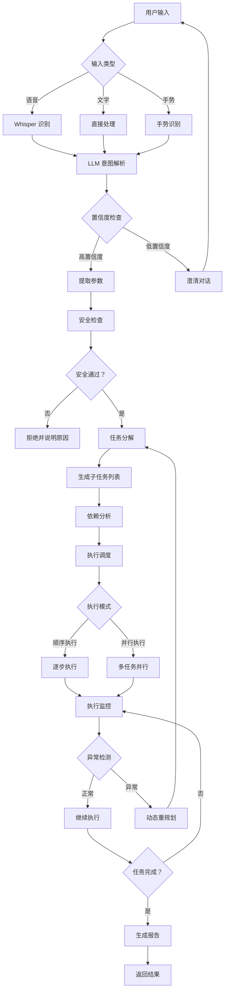

# LLM 任务规划工作流



## 关键决策点

| 决策点 | 决策依据 | 处理方式 |
|--------|---------|---------|
| 置信度检查 | LLM 输出置信度 | <0.7 则澄清 |
| 安全检查 | 硬编码规则 | 不通过则拒绝 |
| 执行模式 | 任务依赖关系 | 无依赖则并行 |
| 异常检测 | 传感器+LLM | 触发重规划 |

## 任务分解层级

```
L0: 用户意图
    "对校园进行全面安全巡逻"

L1: 主要阶段
    ├── 巡逻东区
    ├── 巡逻西区
    ├── 巡逻北区
    └── 返航

L2: 具体动作
    ├── 飞到东区入口
    ├── 沿主路飞行
    ├── 拍照检查
    └── 移动到下一区域

L3: 原子操作
    ├── goto(31.23, 121.47, 15)
    ├── hover(10)
    ├── capture_photo()
    └── goto(31.24, 121.48, 15)
```
