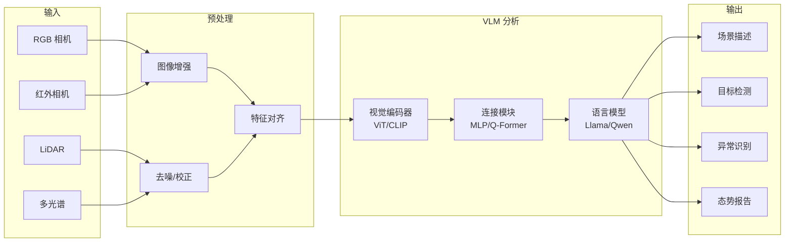

# VLM 感知流水线



## VLM 在无人机中的应用

```
┌─────────────────────────────────────────────────┐
│                VLM 应用场景                      │
├─────────────────────────────────────────────────┤
│                                                 │
│  ┌──────────┐  ┌──────────┐  ┌──────────────┐  │
│  │ 场景理解 │  │ 目标检测 │  │ 异常检测     │  │
│  │          │  │          │  │              │  │
│  │ "这是工业│  │ "找到红色│  │ "发现围栏    │  │
│  │  园区"   │  │  车辆"   │  │  损坏"       │  │
│  └──────────┘  └──────────┘  └──────────────┘  │
│                                                 │
│  ┌──────────┐  ┌──────────┐  ┌──────────────┐  │
│  │ 视觉问答 │  │ 变化检测 │  │ 报告生成     │  │
│  │          │  │          │  │              │  │
│  │ "有积水吗│  │ "新增了  │  │ "巡检报告:   │  │
│  │  ？"     │  │  一栋楼" │  │  无异常"     │  │
│  └──────────┘  └──────────┘  └──────────────┘  │
│                                                 │
└─────────────────────────────────────────────────┘
```

## 模型选择决策树

```
需要 VLM 分析？
├── 需要最强性能？ → GPT-4V / Gemini (API)
├── 需要中文支持？ → Qwen-VL / InternVL2
├── 需要本地部署？
│   ├── GPU 24GB+？ → LLaVA-1.6 13B
│   ├── GPU 8-16GB？ → LLaVA-1.6 7B
│   └── GPU <8GB？ → MiniCPM-V / InternVL2-1B
└── 需要实时性？ → 轻量 VLM + 传统 CV 混合
```
